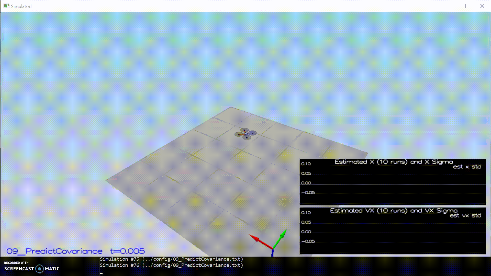

# Estimation Project #

Welcome to the estimation project.  In this project, the estimation portion of the controller used in the CPP simulator is developed.  At the very last step the simulated quad is flying with the estimator out of this project and the custom controller out of the [previous project](https://github.com/StefanThaenert/FCND-Controls-CPP.git)!

## Setup ##

This project will continue to use the C++ development environment you set up in the Controls C++ project.

 1. Clone the repository
 ```
 git clone https://github.com/StefanThaenert/FCND-Estimation-CPP.git
 ```

 2. Import the code into your IDE like done in the [Controls C++ project](https://github.com/StefanThaenert/FCND-Controls-CPP.git)
 
 3. You should now be able to compile and run the estimation simulator just as you did in the controls project


## The Tasks ##

Once again, you the estimator is build in pieces.  At each step, there is a set of success criteria that is displayed both in the plots and in the terminal output.

Project outline:

 - [Step 1: Sensor Noise](#step-1-sensor-noise)
 - [Step 2: Attitude Estimation](#step-2-attitude-estimation)
 - [Step 3: Prediction Step](#step-3-prediction-step)
 - [Step 4: Magnetometer Update](#step-4-magnetometer-update)
 - [Step 5: Closed Loop + GPS Update](#step-5-closed-loop--gps-update)
 - [Step 6: Adding Your Controller](#step-6-adding-your-controller)

I directly commented the steps within the code to get link to the [Estimation for Quadrotors](https://www.overleaf.com/project/5c34caab7ecefc04087273b9).


### Step 1: Sensor Noise ###

As you see in the video below the drone is just hovering, but with the given measurements of the gps signal and the IMU the standard deviation has been calculated in this [notebook](config/log/Step1SensorNoiseGPS_ACC.ipynb)

<p align="center">

</p>


### Step 2: Attitude Estimation ###

To improve the complementary filter-type attitude filter I created  a trotation matrix based on the current Euler angles and used this to update the predicted Roll and Pitch angles.

<p align="center">

</p>

### Step 3: Prediction Step ###

In this step I implemented the prediction step of the filter to ensure only a slow drift as you may see in the following animation.

<p align="center">

</p>

Next I implemented the `GetRbgPrime()` and the `Predict()` function based on formulas out of [Estimation for Quadrotors](https://www.overleaf.com/project/5c34caab7ecefc04087273b9).

<p align="center">

</p>

### Step 4: Magnetometer Update ###

Up until now I've only used the accelerometer and gyro for the state estimation.  In this step, I added the information from the magnetometer to improve your filter's performance in estimating the vehicle's heading. By implementing `UpdateFromMag()` and tuning th parameter  `QYawStd` within `QuadEstimatorEKF.txt` the following behaviour occurs.

<p align="center">

</p>


### Step 5: Closed Loop + GPS Update ###

By implementing the `UpdateFromGPS()` and tuning the process noise model in `QuadEstimatorEKF.txt` the drone is capable to complete the entire simulation cycle with an estimated position errer of less than 1m.

<p align="center">

</p>


### Step 6: Adding Your Controller ###

In this last step I exchanged the controller for the quad with the contorller I created in the previous project. There was some retuning within `QuadControlParams.txt` required especially on `kpVelXY` to increase the agility of the drone. 

<p align="center">

</p>

## Authors ##

Thanks to Udacity for this course and Fotokite for the initial development of the project code and simulator.